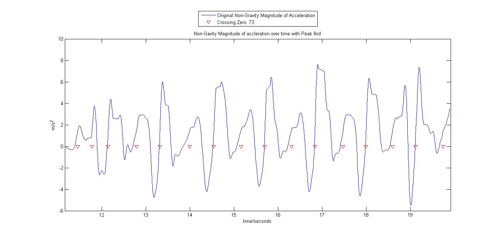
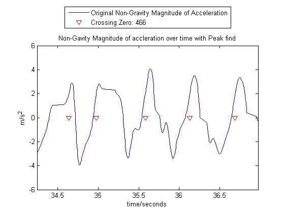
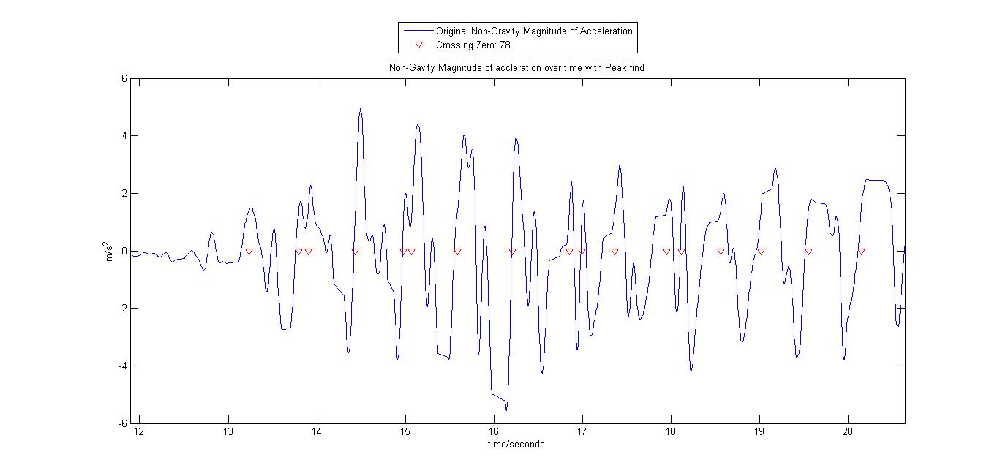

# sensibility_testbed
# pedometer

--Update 2/8/2016--
Seperate the step_counter.r2py into pedometer.r2py, pre_calibration.r2py, step_detection.r2py and moving_average.r2py. Preparing for threading.

This project focus on indoor path tracking / localization based on sensibility_testbed. By analysis of the accelerometer data, it can determine device's different carry method(trouser pocket, coat porcket or hold in hand) and detecting walking step correctly by crossing zero method. Improving the accuracy for different devices by introducing pre-calibration stage, noise level thresholding and moving average filter. 

The figure above shows the acceleration variation curve when put the phone in the trousers' right pocket. The higher peak is for right step, and lower peak is for left step. The acceleration is combined with right leg's and body's acceleration.

Above figure shows the acceleratino when put the phone into coat pocket. The peaks are almost at a same level. The acceleration only based on body's acceleration.

Above shows when holding the phone in front of the chest. There are some narrow and lower pulses following with the major pulses. Those narrow pulses came from the slight vibration of arm while walking.

Finished work: Pedometer
Future plan: Distance estimation
